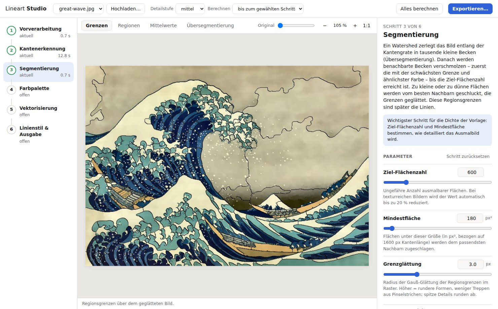

# Lineart-Pipeline: Raster → Ausmalbuch-SVG

Wandelt Fotos und Gemälde in druckfertige Vektorgrafiken für Ausmalbücher um:

| Ausgabe | Inhalt |
|---|---|
| `<name>.lines.svg` | Ausmalvorlage: schwarze Konturen auf Weiß, alle Flächen geschlossen |
| `<name>.color.svg` | Dieselben Konturen über flächigen Farbregionen (`<g id="color-fills">` unter `<g id="line-art">`) |
| `<name>.lines.png` / `.color.png` | Vorschau-Renderings (1600 px) |
| `index.html` | Vergleichs-Report: Original · Vorlage · Kolorierung mit Überblend-Slider |

Benchmark-Ergebnisse für `source/great-wave.jpg` und `source/starry-night.jpg` liegen in [`output/`](output/) (Report: [`output/index.html`](output/index.html)).

---

## 1. Installation & Ausführung

Voraussetzung: Python ≥ 3.10 (getestet mit 3.11), Linux oder macOS. Eine GPU wird nicht benötigt.

```bash
./setup.sh                                    # .venv + Abhängigkeiten + Modellgewichte
.venv/bin/python pipeline.py -i source/ -o output/
```

Manuell:

```bash
python3 -m venv .venv
.venv/bin/pip install -r requirements.txt     # oder: pip install -e ".[preview]"
.venv/bin/python -m lineart.models            # lädt DexiNed (~47 MB) nach weights/
```

Die Gewichte werden beim ersten Lauf auch automatisch geladen (SHA-256-geprüft). Für die PNG-Vorschauen braucht `cairosvg` die System-Bibliothek cairo (`brew install cairo` bzw. `apt install libcairo2`). Fehlt sie, laufen die SVG-Erzeugung und der HTML-Report trotzdem; nur die PNGs werden übersprungen.

### CLI

```bash
python pipeline.py -i <bild|ordner> [-o output/] [--mode lines|color|both] [-d low|medium|high] [Optionen]
```

| Option | Wirkung |
|---|---|
| `-i/--input` | Bilddatei oder Verzeichnis (jpg, png, webp, tif, bmp) |
| `-o/--output` | Zielverzeichnis (Default `output/`) |
| `--mode` | `lines`, `color` oder `both` (Default) |
| `-d/--detail-level` | Preset `low` (≈ 280 Flächen, 12 Farben), `medium` (≈ 600, 18), `high` (≈ 1100, 26) |
| `--regions N` | Zielanzahl der Ausmalflächen (Default 600) |
| `--colors N` | Palettengröße der kolorierten Fassung (Default 18) |
| `--smoothing 0..1` | Stärke der kantenerhaltenden Rauschfilterung (Default 0.5; 0 = aus) |
| `--min-area PX` | Kleinste erlaubte Fläche, bezogen auf 1600 px Kantenlänge (Default 180) |
| `--label-sigma` / `--curve-sigma` | Glättung der Regionsgrenzen, Raster bzw. Vektor (Default 3.0 / 1.6; 0 = aus) |
| `--line-width F` | Multiplikator für alle Strichstärken (Default 1.0) |
| `--work-size PX` | Arbeitsauflösung, lange Kante (Default 1600) |
| `--edge-backend` | `auto` (Default), `dexined` oder `classical` (ohne Modell) |
| `--config FILE` | Komplette Konfiguration als JSON (z. B. aus der GUI exportiert); explizite Flags haben Vorrang |
| `--no-preview`, `--no-report`, `--debug`, `-q` | PNGs / Report weglassen, Zwischenbilder speichern, leise |

Erweiterte Feinparameter (Defaults sind abgestimmt; ihre Wirkung lässt sich in der GUI direkt beobachten): `--clahe-clip`, `--global-weight`, `--min-width`, `--edge-weight`, `--color-scale`, `--chroma-boost`, `--color-merge-edge`, `--simplify-eps`, `--major-threshold`. `python pipeline.py -h` beschreibt alle.

Die genannten Defaults gelten für `-d medium`. Ein nicht gesetzter Feinjustage-Parameter übernimmt den Wert des aktiven Presets; `low`/`high` verschieben u. a. `--smoothing` (0.7 / 0.35), `--regions` (280 / 1100), `--min-area` (420 / 90), `--label-sigma` (4.0 / 2.0) und `--curve-sigma` (2.0 / 1.3). Ein explizit gesetzter Parameter überschreibt den Preset. Keiner der Glättungsparameter ist standardmäßig aus — „aus“ erfordert explizit `0`.

Exit-Code ≠ 0, wenn eine erzeugte SVG die Verifikation nicht besteht.

### Interaktive GUI (Lineart Studio)

```bash
.venv/bin/python gui.py                      # öffnet http://127.0.0.1:8765/ im Browser
.venv/bin/python gui.py source/mein-bild.jpg -o output/ --port 8765
```



Eine lokale Web-Oberfläche, die die Pipeline Schritt für Schritt begleitet. Sie braucht keine zusätzlichen Abhängigkeiten (Python-Standardbibliothek + Vanilla-JS).

- **Links: die sechs Pipeline-Schritte** – Vorverarbeitung, Kantenerkennung, Segmentierung, Farbpalette, Vektorisierung, Linienstil. Der Status zeigt, ob ein Schritt *aktuell*, *veraltet* (Parameter geändert) oder noch *offen* ist, dazu die Rechenzeit.
- **Mitte: Zwischenergebnisse** des gewählten Schritts in mehreren Ansichten, z. B. globaler vs. gekachelter DexiNed-Pass, Watershed-Übersegmentierung, durch gleiche Farbe entfernte Grenzen (rot), Pixeltreppen vs. Bézier-Kurven oder die Linienhierarchie. Zoom mit Mausrad, Verschieben per Ziehen, Doppelklick = einpassen. Der Regler *Original* blendet das Eingabebild darunter ein; Taste `O` gedrückt halten zeigt nur das Original. Zoom und Ausschnitt bleiben beim Wechsel zwischen Schritten erhalten, sodass dieselbe Stelle über alle Stufen verglichen werden kann.
- **Rechts: Erklärung und Parameter** des Schritts mit Hilfetexten, Markierung geänderter Werte (↺ setzt auf das Preset zurück) und Kennzahlen des Ergebnisses (Flächenzahl, Texturmaß, Palette, Dateigrößen …).
- **Inkrementelle Neuberechnung:** Jeder Schritt wird gecacht. Eine Änderung rechnet nur den betroffenen Schritt und die nachfolgenden neu – Linienstil-Parameter reagieren praktisch live, Segmentierung in 1–3 s. Berechnet wird wahlweise bis zum gewählten Schritt, immer bis zum Ende oder nur manuell.
- **Export** schreibt SVGs, PNG-Vorschauen, `stats.json` und `<name>.config.json` in den Ausgabeordner und prüft die SVGs wie die CLI. Der Dialog zeigt außerdem den äquivalenten CLI-Aufruf; `python pipeline.py -i bild.jpg --config output/bild.config.json` erzeugt byte-identische SVGs.

Empfohlener Ablauf: Arbeitsauflösung auf 800 px senken (alles rechnet ein Vielfaches schneller), Parameter einstellen, dann für den Export wieder auf 1600 px oder höher stellen. Flächengrößen, Glättungsradien und Strichstärken skalieren mit der Auflösung, die Ergebnisse sind aber nicht pixelgleich.

Bilder lassen sich über die Auswahlliste (Inhalt von `source/`, änderbar mit `-s`), den Button *Hochladen* oder per Drag & drop öffnen. Der Server lauscht standardmäßig nur auf `127.0.0.1`.

### Neue Bilder verarbeiten

Bild nach `source/` legen (oder beliebigen Pfad angeben) und z. B. `python pipeline.py -i source/mein-bild.jpg -d medium` aufrufen. Faustregeln:

- **Zu viele / zu kleine Flächen:** `-d low` oder `--regions 300 --min-area 400`
- **Wichtige Details fehlen:** `-d high` oder `--regions 900`
- **Zackige Linien bei Gemälden:** `--label-sigma 5`
- **Für großformatigen Druck:** `--work-size 2400` (dauert etwa doppelt so lange)

Tests: `.venv/bin/python -m pytest` (synthetisches Bild, klassisches Backend, Session-Cache und HTTP-API der GUI, < 5 s).

---

## 2. Architektur

```
Eingabebild
  │
  ▼
[1] Vorverarbeitung        preprocess.py   Resize (1600 px), CLAHE, Mean-Shift + Bilateral
  │
  ├──────────────────────────────┐
  ▼                              ▼
[2a] Kantenwahrscheinlichkeit    [2b] Farbe (Lab, robuster Regionsmittelwert)
  edges.py  DexiNed (ONNX)            palette.py
  global + gekachelt fusioniert          │
  │                                      │
  ▼                                      │
[3] Regionen = Linien  segment.py        │
  Watershed auf Kantenkarte → RAG-       │
  Merging (Kante + Farbe + Größe) →      │
  Klein-/Splitterflächen absorbieren →   │
  Gauß-Label-Glättung → Topologie-Fix    │
  │                                      ▼
  │                      Flächengewichtetes K-Means → Palette;
  │                      gleichfarbige Nachbarn ohne echte Kante verschmelzen
  ▼                                      │
[4] Planarer Grenzgraph  topology.py  ◄──┘
  Crack-Grid-Tracing → Ketten zwischen Knotenpunkten → Ringe je Region
  │
  ▼
[5] Vektorisierung  vectorize.py
  Kettenglättung (Endpunkte fix) → Douglas-Peucker → Catmull-Rom-Béziers
  Linienhierarchie: Kantenstärke + Farbkontrast → lines-major / lines-minor
  │
  ├─► *.lines.svg
  └─► *.color.svg   → verify.py (XML, viewBox, Layer, Füll-Abdeckung) → report.py
```

### Zentrale Entscheidung: Linien sind Regionsgrenzen

Statt Kanten zu detektieren und dann zu vektorisieren (Canny/DexiNed → potrace/VTracer), partitioniert die Pipeline das Bild in Regionen; die Linien sind die Grenzen dieser Partition. Daraus folgen drei Anforderungen direkt:

- **Geschlossene Flächen:** Eine Partition hat per Definition keine offenen Linien oder Lücken. Jede Fläche lässt sich mit dem Füll-Werkzeug füllen.
- **Keine Doppelkonturen:** Der Watershed läuft auf der Kantenwahrscheinlichkeit. Beckengrenzen liegen auf dem *Grat* der Kantenantwort, also mittig auf einer gemalten Kontur, nicht an ihren beiden Rändern.
- **Exakte Kongruenz von Farbe und Linie:** Jede Grenzkette wird einmal geglättet und als Bézier-Folge gespeichert. Linien-Layer und Füllpfade beider angrenzenden Regionen nutzen *dieselben* Kurven, einmal vorwärts, einmal rückwärts. Versätze oder weiße Blitzer sind dadurch ausgeschlossen. `verify.py` rendert nur die Füllflächen (ohne Linien und Hintergrund) und misst die unbedeckten Pixel: bei beiden Benchmarks 0,0 %.

### Toolwahl und Begründung

| Stufe | Wahl | Warum |
|---|---|---|
| Kanten | **DexiNed** (opencv_zoo-Export, MIT) via **onnxruntime** | Semantische Kanten statt Gradienten, läuft auf CPU in ~1 s pro 640×480-Kachel. Der Export nutzt blockweise int8-`DequantizeLinear`-Knoten, die onnxruntime ablehnt. `models.py` faltet die Gewichte daher einmalig nach FP32 (numerisch identisch zu OpenCV-DNN, max. Abweichung 1e-4, aber 3× schneller). |
| Multi-Scale | Globaler Pass (ganzes Bild in einem Frame) × gekachelter Pass | Im globalen Pass liegen Pinselstriche unter dem rezeptiven Feld, nur große Objektkonturen bleiben. Das geometrische Mittel lässt Kachel-Details nur dort durch, wo auch global Struktur ist. |
| Vorglättung | `pyrMeanShiftFiltering` + Bilateral | Plattet Pinselstriche und Papierstruktur zu Plateaus und erhält dabei Grenzen. |
| Segmentierung | Marker-Watershed + eigener RAG-Merger (Priority Queue) | Kosten aus mittlerer Grenzkantenstärke (85 %) und ΔE in Lab (15 %), gewichtet nach Flächengröße. Gesteuert über eine Ziel-Flächenzahl, weil absolute Schwellen zwischen Holzschnitt und Ölgemälde nicht übertragbar sind. |
| Lückenschluss/Bereinigung | Absorption kleiner und dünner Flächen (mittlere Breite 2A/U), Gauß-Label-Voting, Entfernen diagonaler Pixelkontakte | Ersetzt morphologisches Schließen und Skelettierung. Da die Pipeline nicht auf Linienpixeln arbeitet, gibt es nichts zu schließen. Das Label-Voting glättet Stufen aus Pinselstrichen, ohne die Topologie zu ändern. |
| Texturadaptivität | Median der Kantenkarte als Texturmaß | Gemälde haben überall Kantenantwort (Starry Night: Median 0,46, Great Wave: 0,05). Bei hoher Textur werden Grenzen stärker geglättet und es entstehen etwas weniger Flächen. |
| Farbe | Getrimmter Regionsmittelwert → flächengewichtetes (√A) K-Means in Lab, Chroma ×1,1 | Harmonische, begrenzte Palette. Durch √-Gewichtung behalten kleine Akzente wie Sterne, Fenster oder der Mond eigene Cluster. |
| Vektorisierung | Eigenes Crack-Grid-Tracing + Gauß-Glättung + Douglas-Peucker + Catmull-Rom → kubische Béziers | VTracer und potrace tracen jede Farbfläche unabhängig, sodass benachbarte Kanten nicht deckungsgleich sind. Der planare Graph garantiert gemeinsame Geometrie. Knotenpunkte bleiben beim Glätten fixiert. |
| SVG | Handgeschrieben, `viewBox`, 1 Nachkommastelle | Linien als zwei Pfade (`lines-major` 3,2 px, `lines-minor` 1,8 px) plus Rahmen, `stroke-linecap/linejoin=round`. Füllflächen je Region ein Pfad (`id="r<n>"`, `data-color=<Palettenindex>`). |

Bewusst **nicht** genutzt:

- **Stable Diffusion / ControlNet:** Laut `docs/research.md` der Flaschenhals ohne GPU. Es ist außerdem nicht deterministisch und kann Inhalte halluzinieren.
- **SAM:** Ein Vordergrund-Fokus ist bei Ganzflächen-Motiven wie den beiden Gemälden nicht hilfreich, da auch der Himmel ausgemalt werden soll. Zudem sind HuggingFace-Gewichte in der Entwicklungsumgebung nicht erreichbar.

Die Architektur lässt beides als zusätzliche Kantenquelle in `edges.edge_map` zu.

### Module

```
pipeline.py            CLI-Einstieg (python pipeline.py …)
lineart/cli.py         Argument-Parsing, Batch-Lauf, Verifikation, Report
gui.py                 GUI-Einstieg (python gui.py …)
lineart/pipeline.py    Orchestrierung als einzeln aufrufbare Stufen (STAGES, Run), Presets (Config)
lineart/preprocess.py  Stufe 1
lineart/edges.py       Stufe 2a (DexiNed global/gekachelt, klassischer Fallback)
lineart/segment.py     Stufe 2b/3 (Watershed, RegionGraph, Bereinigung)
lineart/palette.py     Farbquantisierung
lineart/topology.py    Planarer Grenzgraph, Ketten, Ringe
lineart/vectorize.py   Glättung, Béziers, SVG-Writer
lineart/verify.py      SVG-Prüfung (XML, viewBox, Layer, Füll-Abdeckung)
lineart/report.py      PNG-Vorschau, output/index.html
lineart/models.py      Download, Checksumme, FP32-Faltung der Gewichte
lineart/gui/           Web-GUI: server.py (HTTP-API, Worker-Thread), session.py (Stufen-Cache,
                       Ansichten), spec.py (Texte, Parameter, Ansichten je Stufe), static/ (Frontend)
tests/                 pytest
```

---

## 3. Ergebnisse, Stärken, Limitierungen

Benchmark auf 4 vCPU (x86_64, ohne GPU), Preset `medium`:

| Bild | Flächen | Palette | Laufzeit | lines.svg | color.svg | Füll-Lücken |
|---|---|---|---|---|---|---|
| great-wave | 580 | 18 | ~26 s | 230 KB | 702 KB | 0,0 % |
| starry-night | 482 | 18 | ~46 s | 263 KB | 796 KB | 0,0 % |

Den Großteil der Laufzeit kosten Mean-Shift (10–25 s) und DexiNed (11–14 s). Segmentierung und Vektorisierung zusammen brauchen unter 5 s.

**Stärken**

- Alle Flächen sind garantiert geschlossen und mit Bucket-Fill ausmalbar. Doppelkonturen und offene Linienenden kommen nicht vor.
- Farbe und Linien sind per Konstruktion deckungsgleich. Layer sind getrennt; Regionen sind einzeln adressierbar (`id`, `data-color`), z. B. für „Malen nach Zahlen“.
- Die Linienhierarchie unterscheidet Hauptkonturen (hohe DexiNed-Evidenz bzw. hoher Farbkontrast) von Binnenlinien.
- Bei der Great Wave sind Gischt-Finger, Wellenbänder, Boote und der Fuji klar erkennbar. Papierflecken im Himmel werden ignoriert.
- Bei Starry Night werden Wirbel, Sterne mit Halos, Mondsichel, Zypresse, Kirchturm und Hügel zu ausmalbaren Formen. Pinselstriche werden zu Flächen gebündelt statt als Linienchaos ausgegeben.
- Der Lauf ist deterministisch (fester Seed) und läuft vollständig lokal auf CPU. Fehlt das Modell, greift ein klassischer Fallback.

**Bekannte Limitierungen**

- **Stilistik bei Gemälden:** Stark texturierte Bereiche wie Dorf, Hügel und Himmelsbänder bei Starry Night werden zu einem „Buntglas“-Mosaik. Das ist ausmalbar, folgt aber nicht immer der Bildsemantik (Häuser vs. Bäume). Ein semantisches Segmentierungsmodell (SAM-Masken als zusätzliche Kantenquelle) oder ein generativer Bereinigungsschritt würde hier helfen.
- **Feine Spitzen:** Die Grenzglättung rundet sehr spitze Formen leicht ab (Gischt-Krallen), und die Mindestfläche entfernt Mikrodetails (Gischtpunkte, Ruderer). Mit `-d high` bzw. `--label-sigma 1.5 --min-area 60` bleibt mehr davon erhalten.
- **Linienhierarchie:** Es gibt nur zwei Stufen, die aus lokaler Evidenz abgeleitet werden. Eine echte Objekt-Silhouetten-Erkennung existiert nicht.
- **Keine Schraffuren/Binnenzeichnung:** Die Ausgabe besteht ausschließlich aus Flächengrenzen. Offene Detailstriche wie Gesichtszüge oder Haarsträhnen kann das Verfahren bewusst nicht erzeugen.
- **Laufzeit:** Mean-Shift ist auf großen, texturreichen Bildern der langsamste Schritt.
- **Dateigröße:** In `*.color.svg` steckt jede Grenze dreimal (zwei Füllflächen plus Linie). Das ist der Preis für unabhängig manipulierbare Layer.
